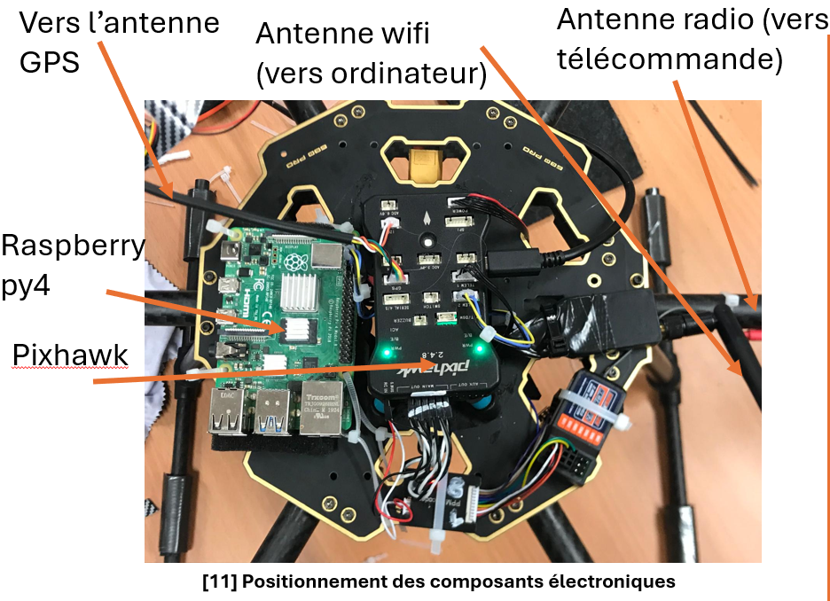
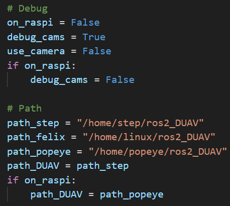

# Multi-drone-system-Ros2
## What Can You Reuse From This Repository?

Hello dear reader,
This project is still a work in progress — but there’s already a lot to learn and reuse if you look in the right places. Here are some valuable components you might find useful:

1. ✅ __A working Finite-State Machine (FSM) implemented using the python-statemachine library__ (v2.5.0), and applied to a real UAV control use case.
📄 File: `src/popeye/popeye/FSM__utils.py`

2. ⚙️ __Parallelizing ROS 2 Callbacks in Python__
Examples of how to handle parallel callback execution efficiently in ROS 
📦 Found throughout the `popeye` package.

3. ✈️ __Lightweight `pymavlink` Communication in ROS 2__
Demonstrates how to communicate over MAVLink without relying on the heavier MAVROS interface — ideal when you need speed, simplicity, and transparency.
📄 File: `src/popeye/popeye/MAV_manager__node.py`

4. 🔄 __Synchronous Action Callbacks in ROS 2 (Python)__
Showcases cleaner patterns for managing UAV commands sequentially, instead of juggling parallel callbacks.
📄 File: `src/popeye/popeye/MAV_manager__node.py`

5. 🧩 __Minimal and Clear .msg, .srv, and .action definitions to use in a UAV lightweight project__
The interfaces package contains message and service definitions tailored for UAV applications, offering a solid starting point for your own projects.

## Hardware Architecture
Each UAV is connected to a Pixhawk 2.4.8 (PX) flight controller, which communicates via MAVLink over USB with a Raspberry Pi 5 (RP5). The RP5s act as onboard computers, enabling each UAV to connect to the Control Ground Station (CGS) through a 2.4 GHz antenna.

The RP5s use the pymavlink library to intercept and filter MAVLink data streams, extracting only the information required for high-level control and fire position detection.

We chose the RP5 for onboard control due to its robustness; relying solely on the CGS proved unreliable in early tests due to frequent disconnections. Initially, we used MAVLink for command and Wi-Fi for debugging (via ROS 2). However, Wi-Fi — even with a powerful antenna — proved unstable for UAV communication, so it's not recommended.

Below is a schematic summarizing our hardware control architecture:
<div style="text-align: center;">
  
  
</div>

## Software Architecture
To control both UAVs and enable reliable communication between them, we opted not to use MAVROS. At the time, its ROS 2 support was still under development, poorly documented, and difficult to compile on the RP5. Instead, we efficiently used minimal pymavlink scripts for commanding our UAVs.

The software stack is organized into three main ROS 2 packages:
 - `olive` (the plane): Performs fire detection and reports position while flying along a predefined Mission Planner route. Minimal ROS 2 logic is used.
 - `control_ground_station`: Acts as a relay to transfer detected fire locations from Olive to Popeye.
 - `popeye` (the hexacoter): Contains most of the system's intelligence, including:
    - A Finite State Machine (FSM) for high-level decision making
    - A camera analysis node using OpenCV
 - `interfaces`: to store custom .msg, .srv and, .action files
 
While this per-agent package design can lead to large packages as features scale, it offered simplicity and speed during development and testing.

## Launch the application

This repository was not originally designed for external users. However, it still offers practical examples of how to use ROS 2 with MAVLink to support your own UAV applications.

⚠️ The application is not user-friendly, mainly due to time constraints:

 - Only one .launch.py script is available (for Olive), and it doesn’t launch the entire system.

 - Installation must be done manually — we did not use ROS 2's package installation tools (ament, rosdep, etc.).

First of all, you need an Ubunutu 22.04 or 24.04 and an Humble or Jazzy ROS2 distribution. Then follow the install process (partially) described in [Installation process](./docs/install.md).

Then, you have to launch SITL instances for the hexacopter (Popeye) and the plane (Olive) using Ardupilot SITL and conenct to it via your best CGS monitoring software.
```bash
# For Olive (plane)
sim_vehicle.py -v ArduPlane -f plane -I1 --no-mavproxy --custom-location=45.4389468,-0.4283327,32.79,0 
# For Popeye (hexacopter)
sim_vehicle.py -v ArduCopter -f hexa -I2 --no-mavproxy --custom-location=45.4389468,-0.4283327,0,0 
```
These SITL will exposed TCP port to connect to. You can modifie the port id in `src/popeye/popeye/MAV_manager__node.py` and `src/olive/olive/MAV_manager__node.py`

Make sure to use the good pathing and configuration for Popeye (`src/popeye/popeye/PARAMS_utils.py`) :
<div style="text-align: center;">
  
</div>

Then, launch the different ROS2 nodes:
```bash
# For olive
ros2 launch olive olive_nodes.launch.py 
# For popeye
ros2 run popeye MAV_manager__node 
ros2 run popeye FSM__node # This launch the control
ros2 run popeye CAM__node # This launch the automatic fire detection
ros2 run popeye ARUCO__node 
# For CGS
ros2 launch control_ground_station cgs_nodes.launch.py
```


Although I will likely not continue this development, feel free to reach out if you need more information or want to build upon this work.

Oh, and by the way… we came second! 🥈
